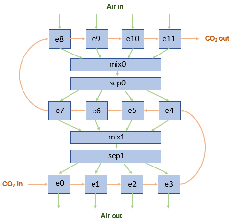
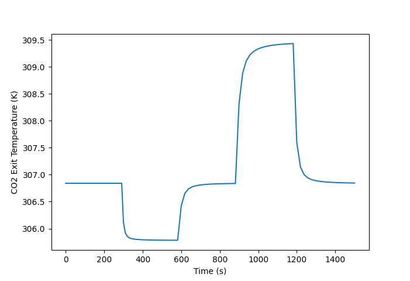
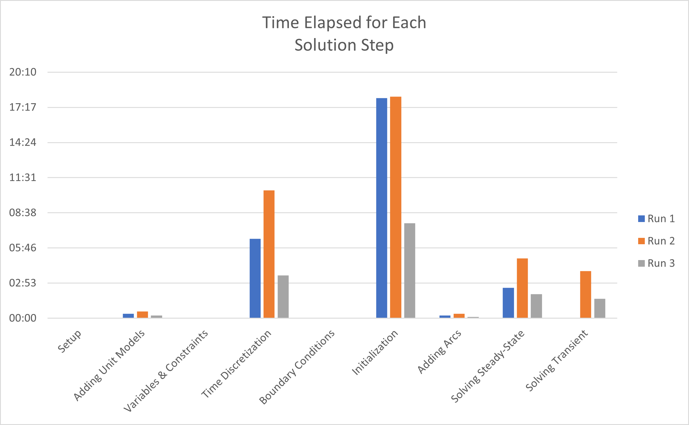

# Heat Exchanger 2D

The goal of this project is to create a two-dimensional, transient model of a countercurrent crossflow heat exchanger. Here, we use a flow network of zero-dimensional heat exchanger elements.

Currently, there are two different network models. With mixers and separators, the air streams are combined at the inlet of each tube pass. Without mixing, there is a separate air stream for each column of elements. Show below are networks with three passes and four elements per pass. The actual flowsheet model has eight and seven respectively.

### Heat Exchanger Network with Mixers and Separators



### Heat Exchanger Network without Mixing


## Code Gen

To the best of my knowledge, we cannot have a list or array of unit models added to an IDAES flowsheet. So each heat exchanger element needs to be uniquely named. To handle this, I wrote a program that generates code blocks that need to be pasted into a flowsheet:

```
python ./flowsheets/code_gen.py
```

Results are added to [here](./flowsheets/sco2_2d_steady_state). The code gen program can work for any number of heat exchanger passes and elements per pass. By default, heat exchanger elements are named `e0`, `e1`, `e2`, ... and so forth.

## Status / Issues

The 2D model is showing reasonable results for steady-state. Without air stream mixing, the flowsheet solves with little difficulty. With mixing, it becomes harder to solve. In any case, the next steps are to:

1. Add the constraints and equations to make HTC's a function of fluid properties. 
2. ~~Add a lumped capacitance term to the 0D model's energy balance. This is started [here](./models/heat_exchanger_lumped_capacitance.py).~~ Done!

Update (2021/07/19):

The lumped capacitance model is working with the 2D flow network. However, we have to set the `dynamic` flag to False in the unit models. This is essentially an assumption that there is no mass accumulation in the heat exchanger tubes, which may not be entirely correct. Still, we can at least model the transient response to temperature step changes:



The full 2D, transient model takes up to 30 minutes to solve. This is with 56 heat exchanger elements, 100 time discretization steps, and constant heat transfer coefficients:


