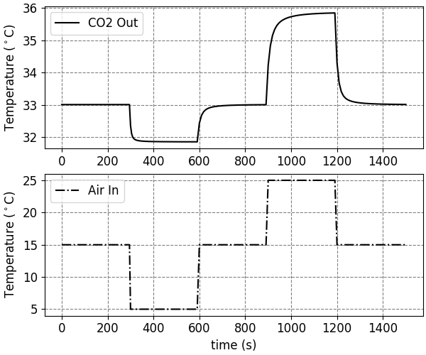
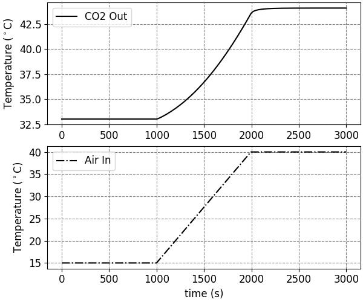

# Supercritical CO2 Air Cooler

This repository contains the code accompanying our paper "Transient Analysis of a Supercritical
Carbon Dioxide Air Cooler Using IDAES". 

## Installation

The recommended procedure is to create a [Conda](https://docs.conda.io/) environment:

```
conda create -n sco2 python=3.8
conda activate sco2
```
Then install IDAES:
```
pip install idaes-pse==1.10.0
idaes get-extensions
```
Finally, add the root folder of this repo to your PYTHONPATH environment variable (or, if using [Windows](https://stackoverflow.com/questions/3701646/how-to-add-to-the-pythonpath-in-windows-so-it-finds-my-modules-packages)):
```
export PYTHONPATH="${PYTHONPATH}:${PWD}"
```

This might also be done with your [Conda](https://conda.io/projects/conda/en/latest/user-guide/tasks/manage-environments.html#saving-environment-variables) environment. If using an IDE such as Pycharm, the working folder should also be changed to the root.

## Usage

To reproduce the results from the paper, run the following flowsheets:
```
python flowsheets/sco2_2d_steady_state.py
python flowsheets/sco2_2d_step_changes.py
python flowsheets/sco2_2d_ramp_up.py
python flowsheets/sco2_2d_ramp_down.py
python flowsheets/sco2_compressor_power.py
```
Each simulation should take roughly thirty minutes to complete. Simulation results will be written to .csv files in the [data](./data) folder.

Then to reproduce the figures:

```
python viz/plot_steady_state.py
python viz/plot_transient.py
python viz/plot_heatmap.py
```

## Surrogate Models

To ease computational burden, the simulations make use of surrogate models. These are hard-coded correlations in the [unit model](./models/heat_exchanger_element.py) source file. We have four such surrogates:

1. hconv (tube) as a function of sCO2 specific heat capacity
2. dP (tube) as a function of sCO2 density
3. hconv (shell) as a function of air temperature
4. sCO2 critical temperature as a function of pressure

These correlations are only valid over a limited range of temperatures and pressures. And with the exception of 4., they are only valid for the geometry and mass flows used in this paper. 

To update the simulations or run them for different boundary conditions or geometries, use the following procedure:

* Update and generate data using [either](./flowsheets/sco2_shell_surrogate.py) of the surrogate [flowsheets](./flowsheets/sco2_tube_surrogate.py).
* Create new correlations using the python files in [surrogates](./surrogates). Model selection can be aided with the MATLAB scripts in the same folder.
* Update the [unit model](./models/heat_exchanger_element.py) with the results from the previous step.
* Update the boundary conditions or geometry parameters on the main simulation [flowsheets](./flowsheets) and rerun.

## Results

For discussion, see the paper.

### Steady-State


### Transient






